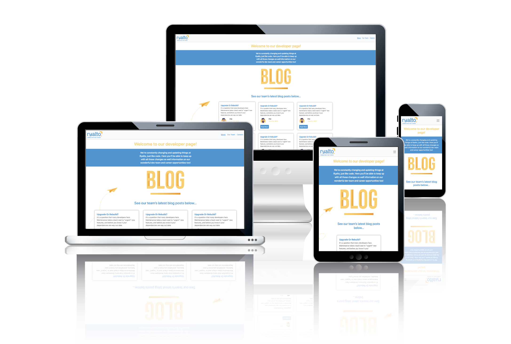

# Ryalto Technical Challenge
(Developer: Jamie Letts)

[Live webpage](https://jamie2210.github.io/ryalto-technical-challenge/index.html)

This project was offered to me as part of a techincal challenge for an interview. I was tasked with the redesign of a mock Ryalto's developer blog page.

[This is the mock page](https://developer.ryalto.group/) 

The approach I took for this challenge was to fix the responsiveness and re-design the site in Ryalto's branding with the focus on clean code and easy to navigate, eye-catching design.
